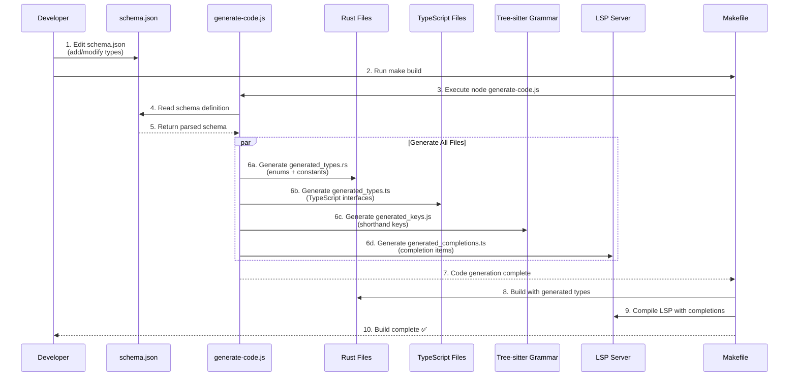

# yCard Core (WASM-first) — YABL Ecosystem

A human-friendly, YAML-like contact format with internationalization support, WASM-first distribution, and comprehensive tooling.

## Architecture

- **ycard-core**: Rust library with WASM and C ABI exports
- **ycard-lsp**: TypeScript LSP server for editor integration
- **ycard-grammar**: Tree-sitter grammar for syntax highlighting
- **ycard-cli**: Command-line interface
- **SDKs**: TypeScript, Python, Go bindings

## Quick Start

### Build Everything
```bash
# Use make (Single Source of Truth)
make                  # Build everything (default)
make dev              # Development build (faster)
make generate         # Generate code from schema.json
make help             # See all options
```

> **Note**: Generated files are automatically created from `schema.json` and are **not committed to git**. 
> Run `make generate` or any build command to create them locally.

### Use CLI
```bash
ycard parse example.ycard --json-ast  # Lenient parsing by default
ycard fmt example.ycard --write
ycard check example.ycard --strict
```

## Build System (DRY - Single Source of Truth)

### 🔄 Schema-Driven Code Generation
All type definitions are generated from `schema.json` to eliminate duplication:



**Generated Files:**
- **Rust enums** (`generated_types.rs`) 
- **TypeScript types** (`generated_types.ts`)
- **Tree-sitter grammar rules** (`generated_keys.js`)
- **LSP completions** (`generated_completions.ts`)

### 🏗️ Unified Build System
All build logic is centralized in the **Makefile**. Other scripts are just thin wrappers:

- **`make generate`** - Generate all code from schema.json
- **`make`** or **`make all`** - Core + WASM + CLI (main build)
- **`make dev`** - Debug build (faster, for development)
- **`make ci`** - Full build with testing (CI/CD)
- **`make full`** - Everything including TypeScript (complete)
- **`make help`** - Show all available targets

### Wrapper Scripts (all delegate to make)
- `./build.sh` - Interactive menu
- `./build-quick.sh` - Quick build (`make all`)  
- `./build-ci.sh` - CI build (`make ci`)

### Development Workflow
```bash
# Quick development iteration
make dev

# Test your changes
./target/debug/ycard parse test.ycard

# Full release build when ready
make all
```

## Features

- ✅ Lenient ingest with strict validation modes
- ✅ International support for 16+ languages
- ✅ Shorthand phone field notation
- ✅ Markdown/YABL integration
- ✅ LSP server with diagnostics and completions
- ✅ WASM-first distribution with optional native prebuilds

## Documentation

See [docs.yabl.dev/ycard](https://docs.yabl.dev/ycard) for full documentation.

## License

MIT